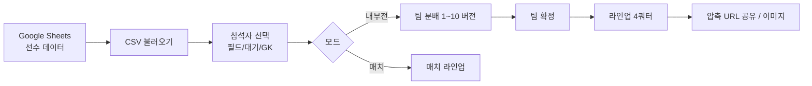
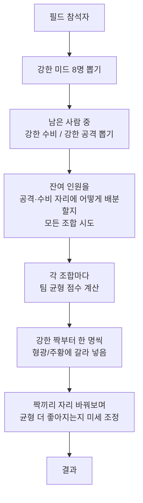
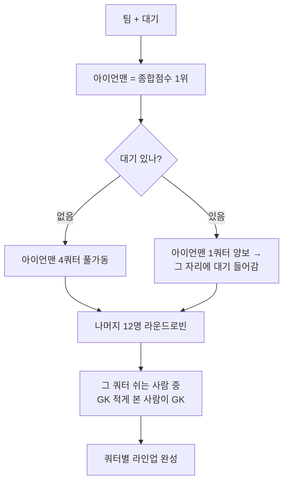

# DEV FC Planner

축구 자체전 인원을 두 팀으로 균형 있게 나누고 4쿼터 라인업을 자동 생성하는 웹 도구. Google Sheets를 선수 DB로 쓰고 팀 분배/라인업 계산은 브라우저에서 한다.



---

## 기능

### 데이터 입력
- **Google Sheets CSV** 로드 (URL은 localStorage에 저장)
- **relation 시트 궁합도**: 선수 이름 매트릭스에서 빈칸/3=제한 없음, 2=가능하면 분리, 1=분리 우선으로 팀 분배에 반영
- **선수추가**: 시트에 없는 용병을 임시 등록. 시트와 같은 이름이면 자동으로 시트 선수로 매칭
- **임시 GK** 추가

#### relation 시트 작성

`relation` 시트는 사람이 보기 쉽게 선수 이름을 행과 열에 모두 둔다. 앱은 대각선과 빈칸을 무시하고, 같은 쌍이 양쪽에 있으면 더 낮은 점수를 우선한다.

|  | 조재형 | 박성진 | 유지웅 |
|---|---:|---:|---:|
| 조재형 |  | 1 |  |
| 박성진 |  |  | 2 |
| 유지웅 |  |  |  |

| 값 | 의미 | 팀 분배 반영 |
|---|---|---|
| 빈칸 또는 3 | 제한 없음 | 페널티 없음 |
| 2 | 가능하면 분리 | 같은 팀이면 중간 페널티 |
| 1 | 분리 우선 | 같은 팀이면 큰 페널티 + 결과 경고 |

### 참석자 구성 (선수검색)
| 버튼 | 동작 |
|---|---|
| **필드** | 정규 참석자로 등록 |
| **대기** | 26명 마감 시 콜업되는 대기 선수로 등록 (시트 선수만) |
| **GK** | 전담 GK로 등록 (포메이션 외 별도) |
| **해제** | 등록 취소 |

- 칩 색상: 회색=정규 / 보라=용병 / 주황=대기
- 모든 선택은 자동 저장 (새로고침 후에도 유지)

### 모드 1: 내부전 (팀 분배 → 라인업)
- 22~36명, 4-3-3 포메이션
- **자동 생성** 한 번 누르면 최대 10가지 형광/주황 분할 버전 생성
- 1~10 버튼으로 자유롭게 버전 전환 (팀 확정 버튼 바로 위에 위치)
- 수동 swap: 다른 팀 선수 둘 클릭 → 자리 교환 (노란 테두리 = 안전 후보)
- **팀 확정** → 라인업 자동 생성

### 모드 2: 매치 (단일 팀 라인업)
- 10~18명. 선수별 출전 쿼터 수 한도 설정 (기본 3Q)

### 라인업 결과
- 4쿼터 × 팀별 ATT/MID/DEF/GK/대기 표기
- 대기 선수 자동 콜업: 형광팀 1Q + 주황팀 2Q
- 압축 URL 공유 / 이미지 캡처 / 피치 시각화

### 기타 UX
- 모바일 우선 (한 줄 칩 그리드, 하단 고정 정보 패널)
- 전체 캐시 초기화 버튼

---

## 사용

```bash
npm install
npm run dev      # 개발 서버
npm run build    # 프로덕션 빌드
```

---

## 알고리즘

### 팀 분배

> "포지션 점수가 비슷한 사람끼리 짝을 만들고, 형광/주황에 한 명씩 갈라 넣는다."



**핵심 원칙**
- 비교는 **포지션 점수가 1순위, 활동 점수는 보조**. 합산 X.
- 균형 점수 = 공격·미드·수비 점수 차이가 가장 무겁게, 활동량은 가볍게, 포지션 강제 배정은 페널티.
- 자동 생성 한 번 → 점수 좋은 순으로 **형광/주황 인원이 다른 분할 최대 10개**를 같이 내놓음. (같은 팀 내 포지션 차이만 다른 건 같은 버전으로 취급)

---

### 라인업

> "스탯 1위(아이언맨) 한 명만 4쿼터 뛴다. 나머지는 모두 정확히 3쿼터."



**핵심 원칙**
- **아이언맨**: 종합점수 1위. 대기 없으면 4쿼터, 있으면 그 자리를 대기에 양보해서 3쿼터.
- **대기 콜업**: 1명만 자동 처리. 형광팀 1Q · 주황팀 2Q (서로 다른 쿼터). 포지션이 안 맞아도 아이언맨 자리에 그대로 들어감.
- **휴식 회전**: 그룹별로 약한 사람부터 한 쿼터씩 돌려가며 쉼.
- **GK**: 수비 풀에서만 뽑지 않고, **그 쿼터 쉬는 예정자 중 GK 횟수 가장 적은 사람**이 봄. 같은 사람이 두 번 GK 안 보고, 5명 수비 팀에서도 한 명이 4쿼터 뛰는 일 없게 함.

**결과 보장 (정상 케이스 13명 + 대기)**
- 아이언맨: 3쿼터 출전
- 나머지 12명 전원: 3쿼터 출전 (4명은 1쿼터 GK · 8명은 1쿼터 휴식)
- 대기: 양 팀 합쳐 2쿼터

---

## 기술 스택

Next.js 14 · TypeScript · Tailwind CSS · localStorage · html2canvas. 백엔드 없이 브라우저에서 모든 계산 수행.
